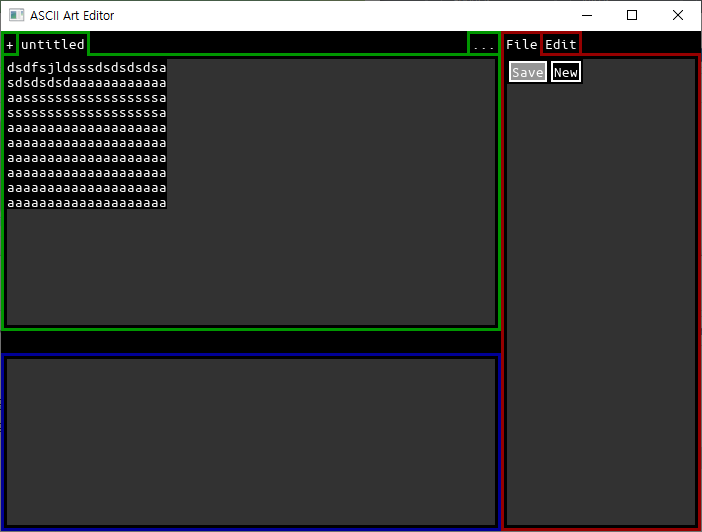

# ASCII Art Editor (Ongoing)

A text art editor, with custom UI made with SDL2. 

Provides pre-compiled `a.exe`.

### Incomplete Project
+ For now, it can only change tabs and click a few buttons - minor interaction with mouse and keyboard.
+ Not very functional with editing options...